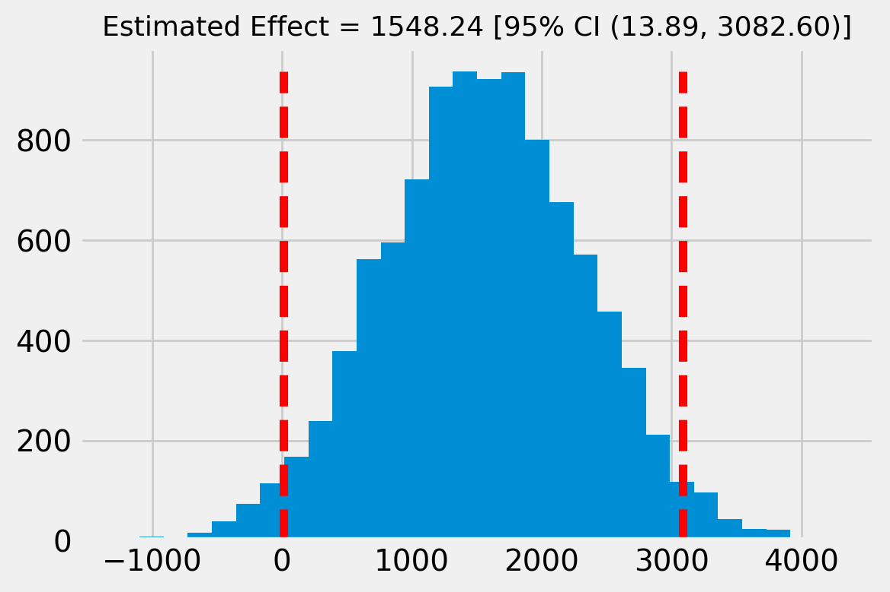

### Causal Inference

This project aims to package a solution for estimating causal effects - both average and heterogeneous - by leveraging well-established methods, such as linear regression, propensity score matching and difference-in-differences, and ML-powered methods that follow some heuristics, such as meta-learners and causal-loss models.

This is the current structure:

```sh
├── Makefile
├── README.md
├── causal_inference
│   ├── __init__.py
│   ├── _exceptions
│   │   ├── __init__.py
│   │   ├── diff_in_diff.py
│   │   ├── doubly_robust_estimator.py
│   │   ├── iv.py
│   │   ├── matching.py
│   │   ├── ml.py
│   │   └── ols.py
│   ├── linear
│   │   ├── __init__.py
│   │   ├── _utils.py
│   │   ├── diff_in_diff.py
│   │   ├── doubly_robust_estimator.py
│   │   ├── iv.py
│   │   ├── matching.py
│   │   └── ols.py
│   └── ml
│       ├── __init__.py
│       ├── _utils.py
│       ├── base.py
│       ├── evaluation.py
│       ├── r_learner.py
│       ├── s_learner.py
│       ├── t_learner.py
│       └── x_learner.py
├── data
│   ├── angrist_and_krueger_1991.csv
│   ├── employment.csv
│   ├── lalonde.csv
│   └── smoking_psyc_distress.csv
├── examples
│   ├── 01.\ ATE\ with\ Linear\ Regression.ipynb
│   ├── 02.\ ATE\ with\ Instrumental\ Variables.ipynb
│   ├── 03.\ ATE\ with\ Propensity\ Score\ Matching.ipynb
│   ├── 04.\ ATE\ with\ Diffence-in-Differences.ipynb
│   ├── 05.\ ATE\ with\ Doubly\ Robust\ Estimator.ipynb
│   └── 06.\ Heterogeneous\ Effects\ and\ ML.ipynb
├── requirements.txt
├── setup.py
└── tests
    ├── __init__.py
    ├── conftest.py
    ├── test_linear
    │   ├── __init__.py
    │   ├── test_diff_in_diff.py
    │   ├── test_doubly_robust_estimator.py
    │   ├── test_iv.py
    │   ├── test_matching.py
    │   └── test_ols.py
    └── test_ml
        ├── __init__.py
        ├── test_evaluation.py
        ├── test_r_learner.py
        ├── test_s_learner.py
        ├── test_t_learner.py
        └── test_x_learner.py
```

Under `causal_inference` I have the actual code for the package. Exploration and theory coverage of main topics have been carried out in the notebooks under `examples/`. 

I have also leveraged GitHub Actions with AWS services, in order to have **CI/CD in place**. Basically, every time there is a push to the *main* branch, the pipeline is triggered:

- Dependencies are properly installed;
- Linting is run to automatically detect errors;
- Unit tests are run as well, as best practices;
- Package is installed.

Additional work could be done in order to make the package available in a central repository.


#### Installing package and running the code

For the sake of making the package available in your own machine, please follow these instructions:

1. Create a new virtual environment

```sh
python3 -m venv ~/.causal-inference
source ~/.causal-inference/bin/activate
```

2. Install it directly from GitHub

(Using HTTP)
```sh
pip3 install git+https://github.com/gfluz94/causal-inference.git
```

(Using SSH)
```sh
pip3 install git+ssh://git@github.com/gfluz94/causal-inference.git
```

3. Import the intended models in your own python code

```python
from causal_inference.linear import OLSEstimator

model = OLSEstimator(data=df, outcome=Y, treatment=T, covariates=X, heterogeneous=False)
model.fit()

model.estimate_ate(plot_result=True)
```

Outputs:
```sh
{"ATE": 1548.243802000623,
 "SE": 781.2792974603111,
 "CI": (13.889909816829004, 3082.597694184417),
 "p-VALUE": 0.04796824155360068}
```




___

For further development and/or doubts, please feel free to reach out: gfluz94@gmail.com
